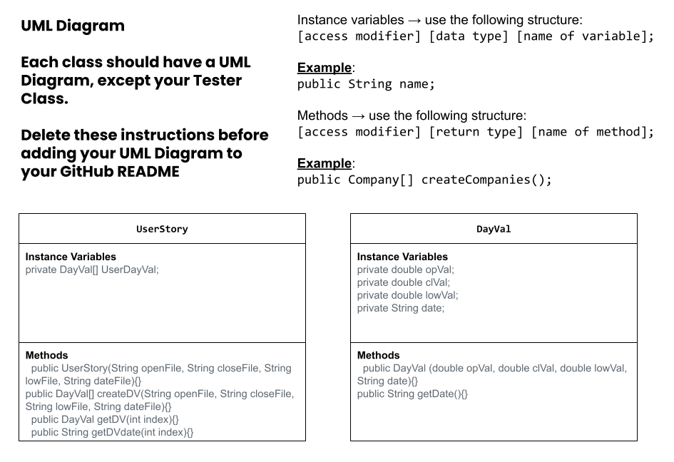

# data-for-social-good-project
APCSA Data for social good project
# Unit 3 - Data for Social Good Project 

## Introduction 

Software engineers develop programs to work with data and provide information to a user. Each user has different needs based on the information they are looking for from data. Your goal is to create a data analysis program for your user that stores and analyzes data to provide the information they need. 

## Requirements 

Use your knowledge of object-oriented programming, one-dimensional (1D) arrays, and algorithms to create your data analysis program: 
- **Write a class** – Write a class to represent your user or business and store and analyze their data with no-argument and parameterized constructors. 
- **Create at least two 1D arrays** – Create at least two 1D arrays to store the data that your user needs information about. 
- **Write a method** – Write a method that finds or manipulates the elements in a 1D array to provide the information your user needs. 
- **Implement a toString() method** – Write a toString() method that returns general information about the data (for example, number of values in the dataset). 
- **Document your code** – Use comments to explain the purpose of the methods and code segments and note any preconditions and postconditions. 

## User Story 

As a financier and advisory service manager, I want to analyze profitability and shares so I could achieve attraction, capital building, and connections

## Dataset 

Include a hyperlink to the source of your dataset used for this project. Additionally, provide a short description of each column used from the dataset, and the data type. 

Example: 

Dataset: https://www.kaggle.com/datasets/varpit94/apple-stock-data-updated-till-22jun2021 
- **closeVal** (double) - Value of AAPL stock when stock market closes
- **dates** (String) - number of people in the country 
- **lowVal** (double) - Lowest value of AAPL stock that day
- **openVal** (double) - Value of AAPL stock when the stock market opens

## UML Diagram 

 

## Description 

In this project we used 1D Arrays to interpret multiple sets of data on Apple (AAPL) stock. Though we did not add several ways for the program to sort through the data, we did incorporate functional user-input with an error message rather than the program breaking. Our program incorporates one instance of user input. When the program is started the user is prompted with a message asking which day values of AAPL they would like to see displayed (with the correct date formatting), then a second message asking if they'd like every AAPL stock day value displayed, and finally an input line. If the user inputs "all" the program will output all 9,909 day values, otherwise the program will search for whatever date the user inputted into the program and output the day values for it. If the date the user inputted is not in the database, the program will output an error message telling the user that the date may not be in the database or that the date was inputted incorrectly.